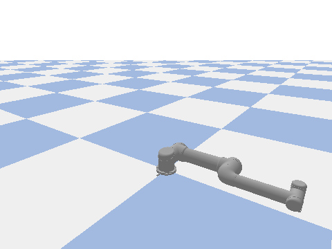
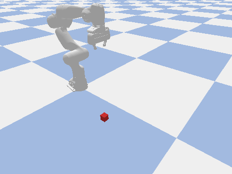
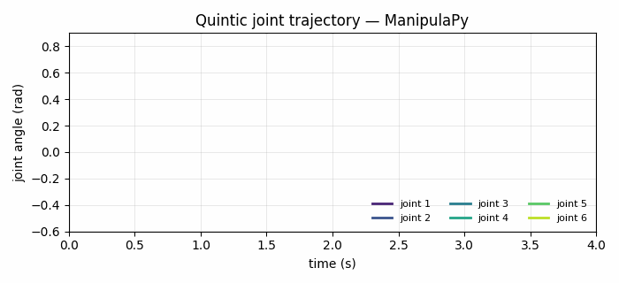
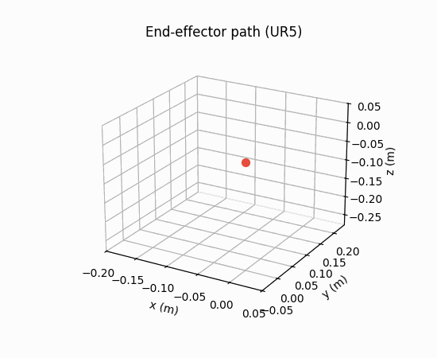
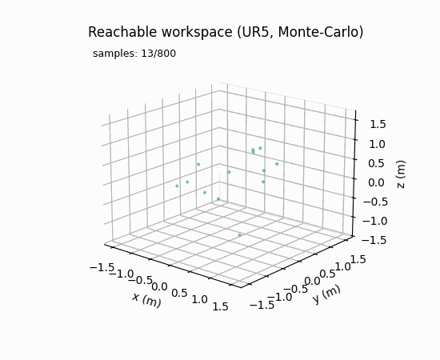
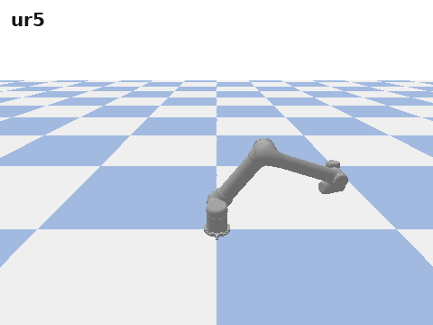

# ManipulaPy

<div align="center">

[](https://pypi.org/project/ManipulaPy/)
[](https://pepy.tech/project/ManipulaPy)
[](https://pypi.org/project/ManipulaPy/)
[](https://github.com/boelnasr/ManipulaPy/stargazers)
[](https://www.python.org/downloads/)
[](https://www.gnu.org/licenses/agpl-3.0)

[](https://codecov.io/gh/boelnasr/ManipulaPy)
[](https://joss.theoj.org/papers/e0e68c2dcd8ac9dfc1354c7ee37eb7aa)

**A modern, GPU-accelerated Python package for robot manipulator kinematics, dynamics, planning, simulation, control, and perception.**

[Quick start](#quick-start) • [Documentation](https://manipulapy.readthedocs.io/) • [Examples](Examples/) • [Changelog](CHANGELOG.md) • [Contributing](CONTRIBUTING.md)



</div>

---

## Why ManipulaPy

Most Python robotics packages cover one slice well — kinematics, simulation, or perception — and force you to glue the rest together. ManipulaPy ships the full stack with a consistent API:

- **Unified surface** — kinematics, dynamics, control, planning, simulation, and vision share the same `SerialManipulator` / `ManipulatorDynamics` objects.
- **GPU when it pays, CPU when it doesn't** — CUDA trajectory and dynamics kernels auto-switch on problem size; the default install is lightweight (NumPy/SciPy/Matplotlib/Numba/Pillow) and heavy deps live behind optional extras.
- **Production-ready URDF** — native NumPy 2.0–compatible parser with `package://`, `file://`, and ROS package discovery built in.
- **25 bundled robots** — Universal Robots, Fanuc, KUKA, Kinova, Franka, UFactory, Robotiq, ABB. Load any of them by name.

---

## Quick start

### Install

```bash
# Lightweight default — kinematics, dynamics, control, native URDF parser, CPU trajectories
pip install ManipulaPy

# Add the features you need:
pip install "ManipulaPy[simulation]"   # PyBullet physics + visualization
pip install "ManipulaPy[urdf]"         # trimesh-backed mesh loading
pip install "ManipulaPy[vision]"       # OpenCV + Ultralytics YOLO + torch
pip install "ManipulaPy[ml]"           # scikit-learn (DBSCAN clustering)
pip install "ManipulaPy[cuda]"         # CuPy 12.x for CUDA 12.x toolchains
pip install "ManipulaPy[all]"          # everything above
```

For CUDA 11.x toolchains use `[gpu-cuda11]`; for AMD/ROCm use `[gpu-rocm]`. Full matrix in the [Installation Guide](docs/source/Installation%20Guide.rst).

#### Apple Silicon (M1/M2/M3)

The default `pip install ManipulaPy` installs cleanly — all CPU features (kinematics, IK, dynamics, trajectory planning) work natively on macOS ARM. PyPI ships no `pybullet` wheel for Apple Silicon, so a source build can fail under Clang; if you need the `[simulation]` extra, install PyBullet from conda-forge first:

```bash
conda install -c conda-forge pybullet
pip install ManipulaPy            # or: pip install "ManipulaPy[simulation]"
```

CUDA/GPU features are not available on macOS — the `[cuda]` extra is skipped automatically (`sys_platform != 'darwin'`).

### Requirements

| | Supported | Notes |
|---|---|---|
| **Python** | 3.9 – 3.12 | CI matrix runs all four; 3.12 added in v1.3.2 |
| **OS** | Linux (primary) · macOS · Windows | CUDA extras Linux-only |
| **CPU stack** | NumPy ≥ 2.0,<3.0 · SciPy ≥ 1.14 · Numba ≥ 0.60 · Matplotlib ≥ 3.9 · Pillow ≥ 8.0 | Installed by default |
| **GPU stack** | CUDA 12.x via `[cuda]` · CUDA 11.x via `[gpu-cuda11]` | NVIDIA, compute capability ≥ 6.0 |
| **Simulation** | PyBullet ≥ 3.2 | Optional, `[simulation]` extra |
| **Vision** | OpenCV ≥ 4.5 · Ultralytics ≥ 8.4 · PyTorch ≥ 1.8 | Optional, `[vision]` extra |

### Verify

```python
import ManipulaPy
ManipulaPy.check_dependencies()    # ✅/❌ for each feature
```

### 30-second demo

```python
import numpy as np
from ManipulaPy.urdf import URDF
from ManipulaPy.ManipulaPy_data import get_robot_urdf
from ManipulaPy.path_planning import OptimizedTrajectoryPlanning

# Load any of the 25 bundled robots by name
robot_urdf = get_robot_urdf("ur5")
robot = URDF.load(robot_urdf)
serial = robot.to_serial_manipulator()
dynamics = robot.to_manipulator_dynamics()

# Forward kinematics
joint_angles = np.array([0.1, 0.2, -0.3, -0.5, 0.2, 0.1])
T = serial.forward_kinematics(joint_angles)
print("end-effector:", T[:3, 3])

# Trajectory planning — auto-switches to GPU when problem is large enough
planner = OptimizedTrajectoryPlanning(
    serial, robot_urdf, dynamics, joint_limits=[(-np.pi, np.pi)] * 6,
)
traj = planner.joint_trajectory(
    thetastart=np.zeros(6), thetaend=joint_angles,
    Tf=5.0, N=1000, method=5,   # 5 = quintic; 3 = cubic; 1 = linear
)
print(f"trajectory: {traj['positions'].shape[0]} points")
```

That snippet runs end-to-end on a default `pip install ManipulaPy` — no GPU required. With the `[cuda]` extra installed, the planner transparently routes large problems (≥ ~1000 waypoints) through the CUDA kernels for 40×+ speedup.

---

## Guided tour

The same `serial` / `dynamics` objects from the demo above feed every module. The snippets below build on that setup.

### Inverse kinematics — three solvers, one interface

```python
from ManipulaPy.kinematics import SerialManipulator  # already loaded as `serial`

# Target pose: 30 cm forward, 20 cm up, no rotation change
T_target = serial.forward_kinematics(np.zeros(6))
T_target[:3, 3] += np.array([0.30, 0.0, 0.20])

# 1. Damped least-squares (fast, single seed)
q_dls, ok, _iters = serial.iterative_inverse_kinematics(
    T_target, thetalist0=np.zeros(6),
)

# 2. Smart IK — picks an initial guess based on a workspace heuristic
q_smart, ok, _iters = serial.smart_inverse_kinematics(
    T_target, strategy="workspace_heuristic", theta_current=np.zeros(6),
)

# 3. Robust multi-start + SQP fallback for tough poses
q_robust, ok, _attempts, solver_name = serial.robust_inverse_kinematics(
    T_target, max_attempts=10,
)
```

`smart_inverse_kinematics` picks an initial guess strategy (workspace heuristic, cached previous solution, etc.) and dispatches to the underlying DLS / SQP / TRAC-IK solver — see `ManipulaPy/ik_helpers.py`.

### Dynamics — mass matrix, gravity, inverse/forward

```python
q  = np.array([0.1, 0.2, -0.3, -0.5, 0.2, 0.1])
qd = np.zeros(6)
qdd_des = np.array([0.1, 0.0, -0.1, 0.0, 0.0, 0.0])
g = np.array([0.0, 0.0, -9.81])
F_ext = np.zeros(6)

M = dynamics.mass_matrix(q)                              # (n, n)
c = dynamics.velocity_quadratic_forces(q, qd)            # (n,)
g_forces = dynamics.gravity_forces(q, g)                 # (n,)
tau = dynamics.inverse_dynamics(q, qd, qdd_des, g, F_ext)  # required torques
qdd = dynamics.forward_dynamics(q, qd, tau, g, F_ext)      # resulting accel
```

### Control — PID and computed-torque in one line each

```python
from ManipulaPy.control import ManipulatorController

ctrl = ManipulatorController(dynamics)
Kp, Ki, Kd = np.full(6, 80.0), np.full(6, 1.5), np.full(6, 20.0)
q_des = np.array([0.2, -0.1, 0.4, -0.3, 0.1, 0.0])

# PID step (joint-space)
tau_pid = ctrl.pid_control(
    thetalistd=q_des, dthetalistd=np.zeros(6),
    thetalist=q,      dthetalist=qd,
    dt=0.01, Kp=Kp, Ki=Ki, Kd=Kd,
)

# Computed-torque step (cancels the nonlinear dynamics)
tau_ctc = ctrl.computed_torque_control(
    thetalistd=q_des, dthetalistd=np.zeros(6), ddthetalistd=np.zeros(6),
    thetalist=q,      dthetalist=qd,
    g=g, dt=0.01, Kp=Kp, Ki=Ki, Kd=Kd,
)

# Ziegler-Nichols auto-tuning from a measured ultimate gain/period
Kp_t, Ki_t, Kd_t = ctrl.ziegler_nichols_tuning(Ku=120.0, Tu=0.65, kind="PID")
```

Also available: `robust_control`, `adaptive_control`, `feedforward_control`, `kalman_filter_control`, plus settling-time / overshoot / rise-time analysis helpers.

### Simulation — PyBullet, with or without GUI

```python
from ManipulaPy.sim import Simulation

sim = Simulation(
    urdf_file_path=robot_urdf,
    joint_limits=[(-np.pi, np.pi)] * 6,
    torque_limits=[(-150, 150)] * 6,
    time_step=1/240,
)
sim.initialize_robot()
sim.set_robot_models(serial, dynamics)
sim.run_trajectory(traj["positions"])     # replay the planner output
sim.close_simulation()
```

`Simulation` works headlessly through PyBullet DIRECT mode (CI-friendly) or with the GUI sliders enabled. Trajectory replay, joint-parameter sliders, end-effector trail visualization, and a reset button are all built in.

### Vision — capture, detect, cluster

```python
from ManipulaPy.vision import Vision
from ManipulaPy.perception import Perception

vision = Vision(camera_configs=[{"device_index": 0, "intrinsic_matrix": K}])
rgb = vision.capture_image(camera_index=0)
# `depth` here is a same-shape ndarray from a depth sensor or stereo reconstruction.

# YOLOv8 detection + depth back-projection in one call (requires [vision])
positions, labels = vision.detect_obstacles(
    depth_image=depth, rgb_image=rgb, depth_threshold=5.0,
)

# Or go one level up: capture + detect + DBSCAN cluster (requires [vision, ml])
perception = Perception(vision_instance=vision)
points, cluster_labels = perception.detect_and_cluster_obstacles(
    camera_index=0, depth_threshold=5.0, eps=0.05, min_samples=10,
)
```

Stereo rectification, disparity, and 3D point-cloud generation live on the same `Vision` class — see `Examples/advanced_examples/perception_demo.py`.

---

## Package layout

```
ManipulaPy/
├── kinematics.py        # SerialManipulator — FK, IK (DLS/SQP/TRAC-IK/smart), Jacobians
├── dynamics.py          # ManipulatorDynamics — M, C, g, inverse / forward dynamics
├── control.py           # ManipulatorController — PID, CTC, adaptive, robust, Kalman
├── path_planning.py     # OptimizedTrajectoryPlanning — CPU/GPU quintic·cubic·linear
├── singularity.py       # Manipulability ellipsoid, condition number, MC workspace
├── potential_field.py   # Attractive + repulsive fields (sign-corrected in v1.3.2)
├── ik_helpers.py        # smart_inverse_kinematics dispatch table + TRAC-IK glue
├── urdf/                # Native URDF parser — package://, file://, ROS discovery
│   ├── parser.py        #   v1.3.2: NumPy 2.0 compatible, no urchin dependency
│   ├── resolver.py      #   PackageResolver — explicit overrides + auto-discovery
│   └── scene.py         #   Visualization / kinematic tree introspection
├── sim.py               # PyBullet wrapper                        [simulation]
├── vision.py            # OpenCV + Ultralytics YOLO + stereo      [vision]
├── perception.py        # Depth → obstacles + DBSCAN clustering   [vision, ml]
├── cuda_kernels.py      # Numba/CuPy kernels                      [cuda]
├── ManipulaPy_data/     # 25 bundled robot URDFs + meshes
└── Benchmark/           # Reproducible CPU vs GPU benchmark suite
```

The library is layered: every higher-level module depends only on the ones above it in this list. You can use `kinematics` / `dynamics` / `control` / `path_planning` end-to-end with zero optional dependencies installed.

---

## What it looks like

<table>
<tr>
<td width="50%" align="center">



**Pick and place**

Panda lifts a cube to a new pose along a quintic-timed path.

</td>
<td width="50%" align="center">



**Trajectory planning**

Quintic time-scaled joint trajectory, CPU or CUDA.

</td>
</tr>
<tr>
<td width="50%" align="center">



**Forward kinematics**

End-effector path computed from the same trajectory.

</td>
<td width="50%" align="center">



**Workspace analysis**

Monte-Carlo reachable workspace, GPU-accelerated.

</td>
</tr>
</table>

All visuals are rendered from the live API — joint and trajectory plots through `matplotlib.animation`, robot bodies through `ManipulaPy.urdf.URDF` + PyBullet's headless renderer.

---

## Features

### Core (always available — pure NumPy/SciPy/Numba)

- **Kinematics** — forward + inverse (DLS, SQP, TRAC-IK, multi-start), Jacobians, geometric error model
- **Dynamics** — mass matrix, Coriolis/centrifugal, gravity, inverse/forward dynamics
- **Control** — PID, computed torque, adaptive, robust, Kalman filtering, Ziegler-Nichols auto-tuning
- **Singularity analysis** — manipulability ellipsoid, condition number, Monte-Carlo workspace
- **Native URDF parser** — `package://`, `file://`, ROS package discovery, explicit `PackageResolver` overrides

### With optional extras

- **`[simulation]`** — PyBullet physics, GUI sliders, collision checking, trajectory replay
- **`[urdf]`** — trimesh-backed mesh loading for visualization
- **`[vision]`** — OpenCV + Ultralytics YOLO + stereo + 3D point clouds
- **`[ml]`** — DBSCAN-based obstacle clustering on top of vision
- **`[cuda]`** — CuPy/Numba CUDA kernels: trajectory generation (40×+), batch trajectories (20×+), inverse dynamics (100×+), Monte-Carlo workspace (10×+)

### Bundled robots

UR3 / UR5 / UR10 / UR3e / UR5e / UR10e / UR16e · Fanuc LR Mate 200iB, M-16iB, CRX-5/10/20/30iA · KUKA iiwa7 / iiwa14 · Kinova Gen3, Jaco 6-DOF, Jaco 7-DOF · Franka Panda · UFactory xArm6 (± gripper) · Robotiq 2F-85 / 2F-140 · ABB IRB 2400.

<p align="center">
  
</p>

Every model loads end-to-end through `ManipulaPy.urdf.URDF.load(...)` and renders in PyBullet via `ManipulaPy.urdf.PackageResolver` — no ROS workspace or external mesh setup required.

```python
from ManipulaPy.ManipulaPy_data import list_robots, print_robot_catalog
print(list_robots())          # iterable of robot keys
print_robot_catalog()         # printable table with specs
```

Full inventory and per-robot details in [`ManipulaPy/ManipulaPy_data/MANIFEST.md`](ManipulaPy/ManipulaPy_data/MANIFEST.md).

---

## Documentation

| | |
|---|---|
| **Tutorials & user guide** | [manipulapy.readthedocs.io](https://manipulapy.readthedocs.io/) |
| **API reference** | [API docs](https://manipulapy.readthedocs.io/en/latest/api/index.html) |
| **Installation matrix** | [`docs/source/Installation Guide.rst`](docs/source/Installation%20Guide.rst) |
| **Runnable examples** | [`Examples/`](Examples/) — basic, intermediate, advanced tracks |
| **Package layout** | [README section](#package-layout) |
| **Release history** | [`CHANGELOG.md`](CHANGELOG.md) |

The `Examples/` tree is the fastest way in. Start at `Examples/basic_examples/` (no extras required), move to `Examples/intermediate_examples/`, then `Examples/advanced_examples/` for the full GPU + vision pipelines.

---

## What's new in v1.3.2

The full release notes are in [CHANGELOG.md](CHANGELOG.md). Highlights:

- **Modular optional extras** — lightweight default install; heavy deps (PyBullet, trimesh, OpenCV, ultralytics, torch, sklearn, CuPy) opt in via `[simulation]`, `[urdf]`, `[vision]`, `[ml]`, `[cuda]`, `[all]`.
- **Native URDF parser** — `ManipulaPy.urdf.URDF` + `PackageResolver`. NumPy 2.0 compatible, no urchin dependency.
- **CUDA kernel correctness** — corrected quintic acceleration; removed shared-memory and forward-dynamics races; added `method=1` (linear) to every kernel variant; N ≤ 1 div-zero guards; **fixed the repulsive-potential gradient sign** (previous versions silently attracted the robot toward obstacles).
- **Simulation guards** — every `Simulation` method that touches PyBullet now raises a clear `ImportError("pip install ManipulaPy[simulation]")` when the extra is missing.
- **Vision defaults** — `Vision.detect_obstacles(depth_threshold=5.0)` (was 0.0, which silently filtered everything).
- **Kalman filter validation** — `kalman_filter_update` validates both `x_hat` and `P` shape before matrix algebra; `calculate_settling_time` returns the first settled time and handles negative setpoints.
- **PEP 561** — `py.typed` marker ships in the wheel; mypy/pyright honor the in-source type hints.
- **Python 3.12** in the CI matrix and PyPI classifiers.

---

## Performance

Numbers below come from artifacts generated by the bundled `Benchmark/` suite. Hardware: 6-DOF xArm6, CPU path (no CUDA), Python 3.10.

### CPU latencies (per call)

From a local `accuracy_benchmark_results/accuracy_benchmark_results.json` artifact generated by `python -m Benchmark.accuracy_benchmark`:

| Component | Mean time | Accuracy |
|---|---|---|
| Forward kinematics | **0.29 ms** | 100 % success, consistency error 0.0 |
| Jacobian | **0.27 ms** | 100 % success |
| Mass matrix + Coriolis + gravity | **1.19 ms** | consistency 2.8 × 10⁻¹⁵ |
| Inverse dynamics | **1.19 ms** | 100 % success |
| Forward dynamics | **1.17 ms** | 100 % success |
| Trajectory planning (N = 200, quintic) | **0.053 ms** | boundary err 2.1 × 10⁻⁷ |
| Trajectory planning (N = 500, cubic) | **0.060 ms** | boundary err 2.0 × 10⁻⁷ |
| PID control step | **0.008 ms** | 100 % success |
| Singularity detection | **0.83 ms** | 100 % known-singular detection |

### IK solver comparison (50 random reachable targets, CPU)

From `Benchmark/ik_branch_benchmark_results.json` — v1.3.2 production code path:

| Solver | Success rate | Median | Mean | p95 |
|---|---:|---:|---:|---:|
| `iterative_inverse_kinematics` (DLS) | 90 % | **11 ms** | 210 ms | 1929 ms |
| `smart_inverse_kinematics` | 96 % | **29 ms** | 1870 ms | 5944 ms |
| `robust_inverse_kinematics` | 96 % | **27 ms** | 908 ms | — |

Median is the right number for typical poses; mean is dragged up by the long tail of hard targets that hit the max-iterations cap. `smart_inverse_kinematics` has the highest success rate but pays for it in retries — pick by your latency vs. coverage budget.

### GPU acceleration

With the `[cuda]` extra installed (`pip install "ManipulaPy[cuda]"`), the trajectory planner, batch trajectory generator, inverse dynamics over a trajectory, and Monte-Carlo workspace sampler all route through Numba / CuPy CUDA kernels. The planner falls back to CPU below its adaptive `N * joints` threshold so small problems don't pay PCIe transfer overhead.

Speedups are workload- and GPU-dependent — reproduce on your own hardware with:

```bash
python -m Benchmark.performance_benchmark   # full CPU vs GPU sweep
python -m Benchmark.quick_benchmark         # CI-friendly subset
```

The full benchmark suite (`Benchmark/README.MD`) covers kinematics, dynamics, trajectory planning, control, vision, and singularity analysis across problem sizes from N = 100 to N = 50,000.

---

## Contributing

Bug reports, feature requests, and pull requests welcome. The flow is documented in [`CONTRIBUTING.md`](CONTRIBUTING.md); the short version:

1. Fork → branch → make the change → `python -m pytest tests/ -q` should be green.
2. New behavior needs a regression test in `tests/test_v132_regressions.py` (or a sibling file).
3. Surgical edits over speculative refactors.
4. Open a PR against `main`. CI runs Python 3.9 – 3.12.

---

## Citation

If you use ManipulaPy in academic work, please cite the JOSS paper:

```bibtex
@article{aboelnasr2025manipulapy,
  title   = {ManipulaPy: A GPU-Accelerated Python Framework for Robotic Manipulation, Perception, and Control},
  author  = {AboElNasr, M. I. M.},
  journal = {Journal of Open Source Software},
  year    = {2025},
  note    = {Submission in review},
  url     = {https://joss.theoj.org/papers/e0e68c2dcd8ac9dfc1354c7ee37eb7aa}
}
```

Paper source: [`paper/paper.md`](paper/paper.md) · review status: [JOSS submission e0e68c2](https://joss.theoj.org/papers/e0e68c2dcd8ac9dfc1354c7ee37eb7aa).

---

## License

[AGPL-3.0-or-later](LICENSE.md). Free for research, education, and AGPL-compatible commercial use; network-deployed services must publish source.

All runtime dependencies are AGPL-compatible: NumPy/SciPy/Matplotlib (BSD), Numba/CuPy (BSD/MIT), Pillow (HPND), PyBullet (Zlib), OpenCV (Apache 2.0), Ultralytics (AGPL-3.0), Trimesh (MIT).

---

## Support

- 📚 [Documentation](https://manipulapy.readthedocs.io/)
- 🐛 [Issues](https://github.com/boelnasr/ManipulaPy/issues)
- 💬 [Discussions](https://github.com/boelnasr/ManipulaPy/discussions)
- 📧 [aboelnasr1997@gmail.com](mailto:aboelnasr1997@gmail.com)

Maintained by [Mohamed Aboelnasr](https://github.com/boelnasr).
