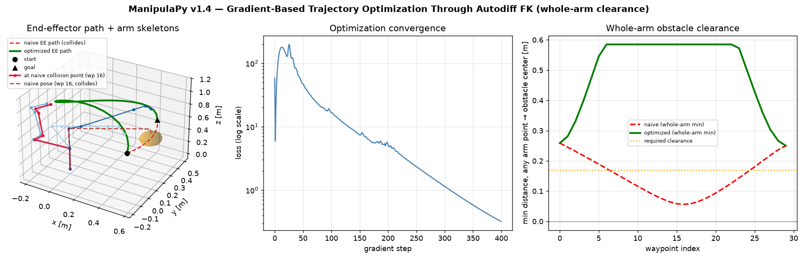

# Introducing ManipulaPy v1.4: robot math that differentiates itself

*Posted 2026-08-10 — the day after the v1.4.0 release.*

ManipulaPy is a Python package for robot manipulator kinematics, dynamics,
planning, control, simulation, and perception — one consistent API instead
of gluing together five single-purpose libraries. Version
[**1.4.0**](CHANGELOG.md#140--2026-08-09) shipped yesterday, and its headline
feature changes what you can ask the library to do: **the same math now runs
on NumPy, CuPy, PyTorch, or JAX, and under the two autodiff backends it's
differentiable.**

```bash
pip install "ManipulaPy[jax-cpu]"
```

```python
from ManipulaPy.backend import use_backend
import jax

with use_backend("jax"):
    T = robot.forward_kinematics(theta)   # same call, JAX arrays out

dT_dtheta = jax.jacrev(robot.forward_kinematics)(theta)   # exact, from autograd
```

## Why that's a bigger deal than it sounds

Most of the hard problems in robotics are optimization problems in disguise:
inverse kinematics minimizes a pose error over joint angles, trajectory
optimization minimizes energy or jerk over a whole path subject to the
dynamics, system identification fits link masses and friction to measured
torques. All of them need gradients. Until now you had two options: derive
the Jacobian by hand (accurate, laborious, and wrong the moment the model
changes) or finite-difference it (easy, but *n*+1 extra model evaluations
per step and a step size that trades truncation error against roundoff).

v1.4 makes automatic differentiation the third option, for free, on code you
already have. `jax.grad(robot.forward_kinematics)` or
`torch.autograd.functional.jacobian(...)` just work — exact to machine
precision, at roughly the cost of one extra forward pass.

Getting there wasn't just plumbing. Building a *tested* differentiable
contract exposed three real defects in the shipped SE(3)/SO(3) code —
`MatrixLog6` silently discarding small rotations, NaN log-gradients near the
identity, an ill-conditioned rotation angle near π — that produced wrong or
non-finite results on **every** backend, NumPy included. Those fixes are
arguably the most important part of this release; the differentiability is
what surfaced them.

## See it solve something a closed-form Jacobian can't

The best way to show this off isn't a benchmark table, it's a robot doing
something you can watch happen. [`showcase/differentiable_reach_showcase.py`](showcase/differentiable_reach_showcase.py)
sets up a Franka Panda reaching across an obstacle:

<p align="center">
  
</p>

<p align="center">
  
</p>

The naive straight-line joint trajectory plows the whole arm through the
obstacle, not just the fingertip — forearm, wrist and gripper included. The
script differentiates an objective — "keep every sampled point along the
kinematic chain outside a combined robot+obstacle margin, stay smooth" —
straight through every link's forward kinematics with `jax.value_and_grad`,
and gradient-descends the path clear of it. Nobody wrote a Jacobian for that
objective; JAX built it from the trace of ordinary ManipulaPy FK calls. It
converges in about a second on CPU:

```bash
pip install "ManipulaPy[jax-cpu,simulation]"
python showcase/differentiable_reach_showcase.py
```

## The rest of what's in v1.4

- **Four backends, one API.** `set_backend(...)` / `use_backend(...)` pick
  NumPy, CuPy, PyTorch, or JAX. NumPy stays the default, and its return
  contract is frozen — existing code and the ROS wrapper are unaffected.
- **A tested differentiable contract**, scoped honestly: `utils`,
  `kinematics`, `dynamics`, and `singularity` carry gradient tests against
  finite differences on both PyTorch and JAX. Every other module runs on all
  four backends via host-boundary conversion but carries **no** gradient
  guarantee — the [Compute Backends guide](docs/source/user_guide/Backends.rst)
  says exactly where that line sits.
- **URDF `package://` containment** — a mesh reference can no longer resolve
  outside the robot-description directory.
- **TPU was tried and explicitly not shipped** — a real TPU v5e run found
  XLA:TPU implements no float64 LU decomposition, so `inv`/`solve` (and every
  dynamics path built on them) raise `UNIMPLEMENTED`, and the float64 matmuls
  that *do* run land at float32 accuracy on the bf16-native MXU. That's a
  hardware/precision mismatch, not a tolerance knob — see the CHANGELOG for
  the full writeup.

Full details: [CHANGELOG.md](CHANGELOG.md#140--2026-08-09).

## Try it

```bash
pip install ManipulaPy                 # lightweight core — no GPU, no extras
pip install "ManipulaPy[jax-cpu]"       # + differentiable backend
pip install "ManipulaPy[all]"           # everything except JAX GPU/TPU wheels
```

- **Showcase**: [`showcase/`](showcase/) — flagship, shareable demos (start here)
- **Examples**: [`Examples/`](Examples/) — basic → intermediate → advanced, runnable scripts
- **Notebook course**: [`notebooks/`](notebooks/), especially
  [`12_differentiable_robotics.ipynb`](notebooks/12_differentiable_robotics.ipynb)
  for the full differentiability deep dive
- **Docs**: [manipulapy.readthedocs.io](https://manipulapy.readthedocs.io/)
- **Repo**: [github.com/boelnasr/ManipulaPy](https://github.com/boelnasr/ManipulaPy)

If you use ManipulaPy in academic work, there's a citable
[JOSS paper](https://doi.org/10.21105/joss.08490) — see [CITATION.cff](CITATION.cff).

Questions, bug reports, and PRs are welcome:
[Issues](https://github.com/boelnasr/ManipulaPy/issues) ·
[Discussions](https://github.com/boelnasr/ManipulaPy/discussions).
