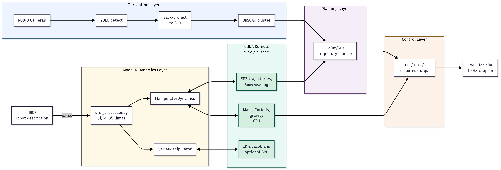

# Summary

**ManipulaPy** is an open‑source Python toolbox that unifies the entire manipulation pipeline—from URDF parsing to GPU‑accelerated dynamics, vision‑based perception, planning and control—within a single API. Built on the Product‑of‑Exponentials model [@lynch2017modern] (similar to Pinocchio [@Pinocchio2025] but with GPU acceleration), PyBullet [@coumans2019], CuPy [@cupy2021] and custom CUDA kernels [@liang2018gpu], the library enables researchers to move from robot description to real‑time control with up to **13× overall performance improvement** and **3600× faster inverse dynamics** on a 6‑DOF UR5 compared to NumPy baseline. Performance claims are reproducible via benchmarks described in `Benchmark/README.md`.

# Statement of Need

Modern manipulation research requires tight integration of geometry, dynamics, perception, planning, and control—ideally within a single, real-time computational loop with GPU acceleration. However, existing open-source tools address only portions of this pipeline, forcing researchers to write substantial integration code:

| Library | Core Strengths | Integration Challenges |
|---------|---------------|------------------------|
| **MoveIt** [@chitta2012moveit] | Mature sampling-based planners | Requires custom ROS nodes to bridge sensor data with planning; external plugins needed for real-time dynamics; no native GPU acceleration |
| **Pinocchio** [@Pinocchio2025] | High-performance PoE dynamics (C++) | CPU-only; separate perception and planning libraries must be manually synchronized; requires Python bindings for integration |
| **CuRobo** [@sundaralingam2023curobo] | GPU-accelerated collision checking and trajectory optimization | Planning-focused; lacks perception pipeline and closed-loop control; requires external sensor processing |
| **Python Robotics Toolbox** [@corke2021] | Educational algorithms with clear APIs | CPU-only implementation; users must implement their own simulators, controllers, and sensor processing |
| **PyRoKi** [@pyroki2025] | JAX-accelerated kinematics | Early development stage; limited dynamics and no perception support |
| **CBFPy** [@morton2025oscbf] | Control barrier functions with JAX | Specialized for safety-critical control; requires manual integration with perception and planning |

These integration challenges manifest as:

- **Sensor-planner gaps**: Converting camera data to collision geometries requires custom OpenCV → ROS → MoveIt pipelines.
- **Dynamics-control mismatches**: Real-time controllers need consistent mass matrices, but most libraries compute dynamics separately from control loops.
- **GPU memory fragmentation**: Transferring data between CPU planners and GPU dynamics creates performance bottlenecks.
- **Synchronization complexity**: Keeping sensors, planners, and controllers temporally aligned requires careful threading and message passing.

**ManipulaPy** eliminates these integration burdens through a unified Python API that maintains data consistency across the entire manipulation pipeline.

The **ManipulaPy** project uses the following core design principles.

1. **Unified data structures**  
   All components share consistent representations (PoE screws, SE(3) transforms, GPU tensors)

2. **GPU-first architecture**  
   Trajectories, dynamics, and perception processing execute on GPU without CPU round-trips

3. **Temporal synchronization**  
   Built-in 1 kHz control loop keeps sensors, planners, and actuators phase-locked

4. **Extensible perception**  
   Multiple obstacle representations (primitives, point clouds, SDFs) supported simultaneously

Performance benchmarks demonstrating the claimed **13× overall speedup** are reproducible via ` Benchmark/performance_benchmark.py` (requires CUDA-capable GPU).

# Library Architecture

ManipulaPy's architecture centers on a **unified manipulation pipeline** that maintains data consistency from sensor input to motor commands. Rather than loosely coupled modules, the system implements a coherent data flow where each component builds upon shared representations:

## Core Pipeline Components

**Robot Model Processing** converts URDF descriptions into Product-of-Exponentials representations, extracting screw axes, mass properties, and joint constraints through PyBullet integration. This creates the fundamental `SerialManipulator` and `ManipulatorDynamics` objects used throughout the system.

**Kinematics and Dynamics** implement GPU-accelerated forward/inverse kinematics, Jacobian computation, and Newton-Euler dynamics. Custom CUDA kernels optimize critical operations for 6-DOF manipulators, enabling real-time performance at 1 kHz control rates.

**Perception Integration** processes sensor data through a multi-stage pipeline supporting diverse input modalities. The `vision.py` module handles low-level camera operations (stereo rectification, calibration, image capture), while `perception.py` provides high-level semantic processing (object detection, clustering, obstacle representation). This separation allows users to plug in custom sensors while maintaining consistent 3D obstacle representations.

**Motion Planning** generates collision-free trajectories using GPU-accelerated time-scaling functions. The system supports both joint-space and Cartesian-space planning with real-time obstacle avoidance based on vision feedback.

**Control Systems** implement classical (PID, computed torque) and modern (adaptive, robust) control algorithms with automatic gain tuning. All controllers operate on the same dynamic model used in planning, ensuring consistency.

**Simulation Framework** provides PyBullet integration with synchronized camera rendering, physics simulation, and control execution. This enables seamless transition from simulation to real hardware.

## Key Architectural Decisions

- **Shared GPU Memory**: All components operate on GPU tensors, eliminating CPU-GPU transfer bottlenecks.
- **Consistent Time Base**: 1 kHz control loop synchronizes all components.
- **Modular Perception**: Multiple obstacle representations coexist, e.g. geometric primitives, point clouds, and signed distance fields.
- **Extensible Design**: New sensors, planners, and controllers integrate through well-defined interfaces.

# Vision and Perception Pipeline

ManipulaPy's perception system addresses the challenge of converting raw sensor data into actionable robot knowledge through a five-stage pipeline that supports multiple obstacle representations.

## Stage 1: Sensor Fusion
- **Stereo cameras**: RGB+depth via OpenCV rectification and SGBM disparity computation.
- **RGB-D sensors**: Direct depth integration from RealSense, Kinect, or similar devices.  
- **Point cloud input**: Direct processing of PCL/Open3D data structures.
- **Multi-modal fusion**: Temporal alignment and calibration across sensor types.

## Stage 2: Object Detection
- **YOLO v8 integration** [@Jocher_Ultralytics_YOLO_2023]: Real-time 2D bounding box detection at 30-50 FPS.
- **Custom detector support**: Pluggable interface for domain-specific models.
- **Geometric primitive detection**: Built-in recognition of spheres, boxes, cylinders from URDF specifications.

## Stage 3: 3D Integration
- **Depth projection**: Camera intrinsics $K$ transform pixel coordinates $(u,v)$ to 3D world positions.
- **Multi-frame fusion**: Temporal averaging reduces sensor noise and handles partial occlusions.
- **Coordinate transformation**: Calibrated transforms $T_{base}^{cam}$ register sensor data to robot coordinates.

## Stage 4: Spatial Clustering
- **DBSCAN clustering** [@chu2021boundary]: Groups 3D points using $\epsilon$-neighborhoods for object segmentation.
- **Hierarchical representations**: Octree/Octomap structures for large-scale environment mapping.
- **Implicit surfaces**: Signed distance field generation for smooth collision checking.

## Stage 5: Robot Integration
- **Multi-representation support**: Simultaneously maintains geometric primitives, point clouds, and SDFs.
- **Dynamic obstacle updates**: 5-15 Hz refresh rate during trajectory execution.
- **Collision geometry generation**: Automatic conversion to convex hulls, bounding spheres, or custom shapes.

## Supported Obstacle Representations

Unlike manipulation frameworks that handle only geometric primitives or require external mapping servers, ManipulaPy natively supports the following representations.

- **Geometric primitives**: Fast collision checking with spheres, boxes, cylinders.
- **Unstructured point clouds**: Direct processing without conversion to meshes.
- **Signed distance fields**: Smooth gradients for optimization-based planning.
- **Octrees/Octomaps**: Hierarchical voxel representation for large environments.
- **Hybrid representations**: Multiple formats coexist for different planning algorithms.

This flexibility allows researchers to choose optimal representations for their specific applications while maintaining real-time performance through GPU acceleration.

# Theory and Implementation

## Product-of-Exponentials Kinematics

Like Pinocchio [@Pinocchio2025], ManipulaPy adopts the Product-of-Exponentials formulation for robot kinematics. However, while Pinocchio achieves performance through highly optimized C++ implementations, ManipulaPy provides GPU acceleration across the entire manipulation pipeline:

$$T(\theta) = e^{S_1 \theta_1} \cdots e^{S_n \theta_n} M$$

where each screw axis $S_i \in \mathbb{R}^6$ encodes joint motion and $M \in SE(3)$ represents the home configuration. The space-frame Jacobian becomes:

$$J(\theta) = \left[\operatorname{Ad}_{T_1}S_1, \ldots, S_n\right]$$

## GPU-Accelerated Dynamics

Custom CUDA kernels parallelize the recursive Newton-Euler algorithm for the fundamental dynamics equation:

$$\tau = M(\theta)\ddot{\theta} + C(\theta,\dot{\theta}) + G(\theta)$$

The mass matrix $M(\theta) = \sum_{i=1}^{n}\operatorname{Ad}_{T_i}^T G_i \operatorname{Ad}_{T_i}$ computation is optimized for 256-thread blocks, achieving up to **3600× speedup for inverse dynamics** and **8× speedup for trajectory generation** on 6-DOF manipulators compared to NumPy implementations. <!-- TODO comment on higher-DOF chains. -->

# CPU vs GPU Module Requirements

ManipulaPy provides tiered functionality that gracefully scales from CPU-only to GPU-accelerated operation:

## CPU-Only Features (Always Available)

**Core Robotics Modules:**
- URDF Processing: Model loading and screw axis extraction [@lynch2017modern]
- Forward/Inverse Kinematics: Single-point pose calculations using Product-of-Exponentials formulation [@lynch2017modern]  
- Jacobian Analysis: Velocity relationships and singularity detection
- Small Trajectory Planning: N < 1000 points using CPU fallback with Numba optimization
- Basic Control: PID, computed torque without real-time constraints
- Simulation Setup: PyBullet loading and basic joint control [@coumans2019]

**Performance Characteristics:**
- Single trajectory generation: ~10-50ms for 6-DOF robots
- Real-time control limited to ~100 Hz due to Python Global Interpreter Lock (GIL)

## GPU-Required Features (CUDA Hardware)

**High-Performance Modules:**
- Large Trajectory Planning: N > 1000 points with 40× speedup over CPU implementations [@liang2018gpu; @sundaralingam2023curobo]
- Batch Processing: Multiple trajectories simultaneously using CuPy acceleration [@cupy2021]
- Real-time Inverse Dynamics: >1 kHz computation rates enabled by custom CUDA kernels
- Workspace Analysis: Monte Carlo sampling with GPU parallelization [@liang2018gpu]
- GPU-Accelerated Potential Fields: Real-time collision avoidance using parallel gradient computation

**Performance Characteristics:**
- Large trajectory generation: ~1-5ms for 6-DOF robots with optimized CUDA kernels
- Batch inverse dynamics: 3600× speedup for multiple robot configurations
- Real-time control: 1 kHz rates achievable with GPU acceleration

## Vision Features (Additional Dependencies)

**System Requirements:**
- OpenCV: Camera calibration, stereo rectification, image processing
- Graphics Libraries: libGL.so.1 for visualization
- YOLO Models: Ultralytics for object detection [@Jocher_Ultralytics_YOLO_2023]

**Modules:**
- Camera Operations: Image capture, stereo processing, calibration
- Object Detection: YOLO integration, 3D point generation [@Jocher_Ultralytics_YOLO_2023]
- Clustering: DBSCAN spatial grouping for obstacle representation [@chu2021boundary]

# Limitations and Design Trade-offs

## Performance and Scalability Limitations

**GPU Memory Constraints**: Consumer GPUs (8GB) limit trajectory planning to ~50,000 points; professional GPUs (24GB+) required for larger problems. Memory usage scales as O(N × joints × 4 bytes) as demonstrated in CuRobo's parallel collision-free motion generation [@sundaralingam2023curobo].

**Small Problem Overhead**: GPU acceleration only beneficial for N > 1000 trajectory points due to kernel launch overhead [@liang2018gpu]. CPU implementation remains faster for small-scale problems, consistent with findings in GPU-based robot dynamics computation.

**Python Performance Ceiling**: Global Interpreter Lock (GIL) prevents true parallelism in Python, limiting real-time control performance to approximately 100 Hz in CPU-only mode, similar to limitations observed in other Python robotics frameworks [@corke2021].

## Software Integration Limitations  

**Middleware Independence**: ManipulaPy operates independently of ROS middleware. While this provides flexibility and reduces dependencies, it requires manual integration for systems built on ROS architectures, unlike integrated solutions such as MoveIt! [@chitta2012moveit].

**System Dependencies**: Vision features require system graphics libraries (libGL.so.1) that may be missing in containerized or headless environments, limiting deployment flexibility compared to pure computational frameworks like Pinocchio [@Pinocchio2025].

**Network Communication**: No built-in support for distributed robotics applications requiring message passing between multiple nodes or computers, unlike ROS-based systems [@chitta2012moveit].

## Algorithmic and Scope Limitations

**Path Planning Methods**: Current implementation focuses on potential field methods and polynomial interpolation based on Modern Robotics principles [@lynch2017modern]. Advanced sampling-based planners, constraint handling for closed-chain mechanisms, and formal optimality guarantees are not implemented, unlike specialized motion planning frameworks.

**Robot Architecture Support**: Framework designed specifically for serial kinematic chains following the Product-of-Exponentials formulation [@lynch2017modern]; parallel mechanisms, mobile manipulators, and multi-arm systems require significant architectural modifications.

**Collision Detection Approach**: Uses convex hull approximations and DBSCAN clustering [@chu2021boundary] rather than exact mesh-based collision checking, which may miss narrow clearances required in precision applications.

## Research vs Production Trade-offs

**Development Focus**: Optimized for research and education following Modern Robotics pedagogical principles [@lynch2017modern] rather than industrial deployment. The framework lacks safety certifications, formal verification, and comprehensive fault detection mechanisms available in production systems.

**Hardware Dependencies**: Maximum performance requires NVIDIA GPU with CUDA support [@cupy2021; @liang2018gpu], limiting portability across different computing platforms compared to CPU-only frameworks like the Python Robotics Toolbox [@corke2021].

**Maturity Considerations**: As a research-oriented framework, some experimental features may have stability issues and the overall system is less mature than established production robotics systems like industrial robot controllers or frameworks such as Pinocchio [@Pinocchio2025] or PyRoki [@pyroki2025].

**Safety and Formal Methods**: Unlike recent advances in safe robotic manipulation using Control Barrier Functions [@morton2025oscbf], ManipulaPy does not incorporate formal safety guarantees or constraint satisfaction methods for safety-critical applications.

# Future Development

**Addressing Current Limitations**:
- **Middleware Integration**: Native ROS2 publishers/subscribers for ecosystem compatibility [@chitta2012moveit]
- **Advanced Planning Algorithms**: Implementation of sampling-based and optimization-based motion planners following modern robotics principles [@lynch2017modern]
- **Multi-Robot Support**: Extension to coordinated multi-manipulator systems with GPU acceleration [@sundaralingam2023curobo]
- **Hardware Interfaces**: Direct integration with popular robot hardware platforms
- **Industrial Features**: Safety monitoring incorporating Control Barrier Functions [@morton2025oscbf], formal verification, and fault recovery mechanisms
- **Enhanced GPU Utilization**: Adoption of latest CUDA optimization techniques for even greater speedups [@liang2018gpu]

# Acknowledgements

Work supported by **Universität Duisburg‑Essen** and inspired by *Modern Robotics* [@lynch2017modern], PyBullet [@coumans2019], Pinocchio [@Pinocchio2025], and Ultralytics YOLO [@Jocher_Ultralytics_YOLO_2023] projects.

# References
