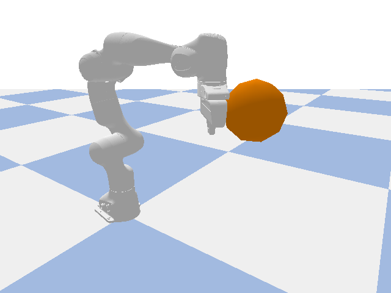

# ManipulaPy Showcase

Flagship, self-contained demos built to be **watched and shared**, not just
read — the kind of thing that goes in a release announcement, a conference
talk, or a "look what this library can do" tweet. If you want a structured
learning path instead, start at [`Examples/`](../Examples/) (basic →
intermediate → advanced) or the [`notebooks/`](../notebooks/) course.

## `differentiable_reach_showcase.py`

<p align="center">
  
</p>

A Franka Panda has to move from a start pose to a goal pose. The cheap path —
a straight line through joint space — plows straight through an obstacle
sitting between the two, and not just at the fingertip: the forearm, wrist,
and gripper sweep through it too. The script fixes the whole arm with
**gradient descent through forward kinematics itself** — differentiating
through every link's origin along the kinematic chain, not only the
end-effector — for an objective ("keep every sampled point along the arm
outside a combined robot+obstacle margin, stay smooth") that nobody
hand-derived a Jacobian for. The per-link clearance uses a fixed-radius
capsule approximation (documented in the script), not full mesh collision —
accurate enough to keep the optimizer honest, not a substitute for one.

That's the pitch for ManipulaPy v1.4's unified backend system: the same
`forward_kinematics` call runs on NumPy, CuPy, PyTorch, or JAX, and under the
two autodiff backends every array op it does becomes a differentiable one.
`jax.grad`/`jax.value_and_grad` of *any* composition of FK calls just works —
exact to machine precision, no finite differences, no second implementation
to keep in sync with the first.

```bash
pip install "ManipulaPy[jax-cpu,simulation]"
python showcase/differentiable_reach_showcase.py
```

Produces:
- `differentiable_reach_showcase.png` — before/after end-effector paths, the
  optimization's loss curve, and the clearance-to-obstacle profile.
- `differentiable_reach_showcase.gif` — the optimized motion, rendered
  headlessly through PyBullet (no GPU or display needed).

Runs in under a second of optimization time on CPU (JAX JIT-compiles the
gradient once, then it's ~3 ms/step for a 28-waypoint, 7-DOF trajectory). No
GPU required for the demo itself; swap `use_backend("jax")` for a CUDA-backed
JAX install and the identical code traces onto the GPU.

The differentiable contract this relies on — which modules carry a gradient
guarantee and which don't — is documented in depth in
[`notebooks/12_differentiable_robotics.ipynb`](../notebooks/12_differentiable_robotics.ipynb).

## Adding to this directory

A showcase entry should be:
- **Self-contained** — runnable as `python showcase/<name>.py` with no
  external setup beyond `pip install`.
- **Fast** — seconds, not minutes, so it's actually watched rather than
  skipped.
- **About something v1.4 (or the latest release) makes newly possible** —
  not a restatement of what's already in `Examples/`.
- **Visual** — a saved PNG or GIF next to the script, embedded in this file.
